## CCTextFieldEffects

[](https://github.com/Cokile/CCTextFieldEffects/blob/master/Licence)
[](https://github.com/Cokile/CCTextFieldEffects/releases)
[](https://img.shields.io/cocoapods/v/CCTextFieldEffects.svg)
[](https://github.com/Carthage/Carthage)

Custom UITextFields effects inspired by [Codrops](http://tympanus.net/Development/TextInputEffects/index.html), which can be used as a simple replacement for `UITextField`. Original effects were built by [Raul Riera](https://github.com/raulriera) using Swift, but ported to Objective-C.

It now supports

|                 Original                 |                Extension                 |                Extension                 |
| :--------------------------------------: | :--------------------------------------: | :--------------------------------------: |
| [Akira](https://github.com/Cokile/CCTextFieldEffects#akira) | [Hideo](https://github.com/Cokile/CCTextFieldEffects#hideo) | [Nariko](https://github.com/Cokile/CCTextFieldEffects#nariko) |
| [Hoshi](https://github.com/Cokile/CCTextFieldEffects#hoshi) | [Haruki](https://github.com/Cokile/CCTextFieldEffects#haruki) | [Sae](https://github.com/Cokile/CCTextFieldEffects#sae) |
| [Isao](https://github.com/Cokile/CCTextFieldEffects#isao) | [Minoru](https://github.com/Cokile/CCTextFieldEffects#minoru) - bug fixed | [Kohana](https://github.com/Cokile/CCTextFieldEffects#kohana) |
| [Jiro](https://github.com/Cokile/CCTextFieldEffects#jiro) | [Kyo](https://github.com/Cokile/CCTextFieldEffects#kyo) |                                          |
| [Kaede](https://github.com/Cokile/CCTextFieldEffects#kaede) | [Kuro](https://github.com/Cokile/CCTextFieldEffects#kuro) |                                          |
| [Madoka](https://github.com/Cokile/CCTextFieldEffects#madoka) | [Ruri](https://github.com/Cokile/CCTextFieldEffects#ruri) |                                          |
| [Yoko](https://github.com/Cokile/CCTextFieldEffects#yoko) | [Chisato](https://github.com/Cokile/CCTextFieldEffects#chisato) |                                          |
| [Yoshiko](https://github.com/Cokile/CCTextFieldEffects#yoshiko) | [Manami](https://github.com/Cokile/CCTextFieldEffects#manami) |                                          |


## Credits

- Thanks to original  effects' developer Raul Riera, [@raulriera](http://twitter.com/raulriera)

  [TextFieldEffects: Custom UITextFields effects inspired by Codrops, built using Swift](https://github.com/raulriera/TextFieldEffects)

- The effect of [Minoru](https://github.com/Cokile/CCTextFieldEffects#minoru) is created by PlusingHalo.

  [ PlusingHalo: iOS Component for creating a pulsing animation](https://github.com/shu223/PulsingHalo)

- The default pencil icon for [Sae](https://github.com/Cokile/CCTextFieldEffects#sae) is made by [Madebyoliver](http://www.flaticon.com/authors/madebyoliver) from [Flaticon](http://www.flaticon.com).


## Installation

### CocoaPods

```ruby
pod 'CCTextFieldEffects'
```

### Carthage

```ruby
github "Cokile/CCTextFieldEffects"
```

### Manual

Drag all the files in the  `CCTextFieldEffects` folder into your project.


## Easy to use and customisable

__Note:__ 

- Although every effect have communal APIs, I do not put them in the same area. In most cases, you just use one effect on a single `UIViewController` or other else, so there is no need to scroll up and down the page to see the communal APIs and unique APIs. Just scroll to the effect you need at first ,all you need is there.


- If you run the demo app in the simulator, the animation may get blocked. You should run it in the real iOS device for better test.


- All the text fields are resigned from first responder by pressing the Return button in the keyboard.
- CCTextFieldEffects requires ARC.


### Akira

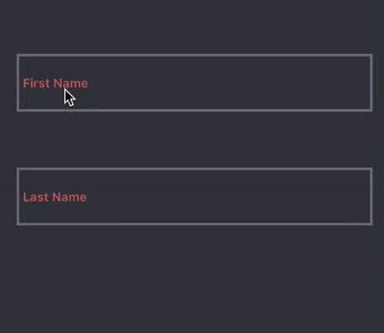

```objective-c
#import "CCTextFieldEffects.h"

//...
@property (strong, nonatomic) AkiraTextField *akiraTextField;

//...
// Recommended frame height is around 70.
self.akiraTextField = [[AkiraTextField alloc] initWithFrame:<#CGRect#>];

self.akiraTextField.placeholder = <#NSString#>;

// The size of the placeholder label relative to the font size of the text field, default value is 0.7
self.akiraTextField.placeholderFontScale = <#CGFloat#>;

// The color of the border, default value is R105 G106 B110 
self.akiraTextField.borderColor = <#UIColor#>;

// The color of the placeholder, default value is R204 G96 B85
self.akiraTextField.placeholderColor = <#UIColor#>;

// The color of the cursor, default value is R170 G170 B170
self.akiraTextField.cursorColor = <#UIColor#>;

// The color of the text, default value is R170 G170 B170
self.akiraTextField.textColor = <#UIColor#>;

// The block excuted when the animation for obtaining focus has completed.
// Do not use textFieldDidBeginEditing:
self.akiraTextField.didBeginEditingHandler = ^{
    // ...
};

// The block excuted when the animation for losing focus has completed.
// Do not use textFieldDidEndEditing:
self.akiraTextField.didEndEditingHandler = ^{
    // ...
};

[self.view addSubview:self.akiraTextField];
```


### Hoshi

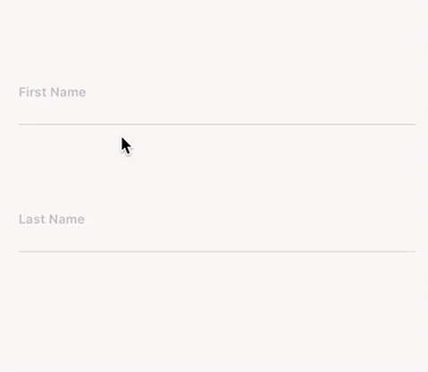

```objective-c
#import "CCTextFieldEffects.h"

//...
@property (strong, nonatomic) HoshiTextField *hoshiTextField;

//...
// Recommended frame height is around 70.
self.hoshiTextField = [[HoshiTextField alloc] initWithFrame:<#CGRect#>];

self.hoshiTextField.placeholder = <#NSString#>;

// The size of the placeholder label relative to the font size of the text field, default value is 0.65
self.hoshiTextField.placeholderFontScale = <#CGFloat#>;

// The color of the inactive border, default value is R185 G193 B202 
self.hoshiTextField.borderInactiveColor = <#UIColor#>;

// The color of the active border, default value is R106 B121 B137
self.hoshiTextField.borderActiveColor = <#UIColor#>;

// The color of the placeholder, default value is R185 G193 B202
self.hoshiTextField.placeholderColor = <#UIColor#>;

// The color of the cursor, default value is R89 G95 B110
self.hoshiTextField.cursorColor = <#UIColor#>;

// The color of the text, default value is R89 G95 B110
self.hoshiTextField.textColor = <#UIColor#>;

// The block excuted when the animation for obtaining focus has completed.
// Do not use textFieldDidBeginEditing:
self.hoshiTextField.didBeginEditingHandler = ^{
    // ...
};

// The block excuted when the animation for losing focus has completed.
// Do not use textFieldDidEndEditing:
self.hoshiTextField.didEndEditingHandler = ^{
    // ...
};

[self.view addSubview:self.hoshiTextField];
```


### Isao
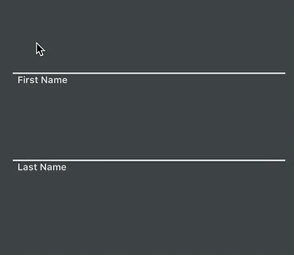

```objective-c
#import "CCTextFieldEffects.h"

//...
@property (strong, nonatomic) IsaoTextField *isaoTextField;

//...
// Recommended frame height is around 70.
self.isaoTextField = [[IsaoTextField alloc] initWithFrame:<#CGRect#>];

self.isaoTextField.placeholder = <#NSString#>;

// The size of the placeholder label relative to the font size of the text field, default value is 0.7
self.isaoTextField.placeholderFontScale = <#CGFloat#>;

// The color of the inactive border and placeholder, default value is R218 G218 B218 
self.isaoTextField.inactiveColor = <#UIColor#>;

// The color of the active border and placeholder, default value is R218 G112 B113
self.isaoTextField.activeColor = <#UIColor#>;

// The color of the cursor, default value is R175 G179 B184
self.isaoTextField.cursorColor = <#UIColor#>;

// The color of the text, default value is R175 G179 B184
self.isaoTextField.textColor = <#UIColor#>;

// The block excuted when the animation for obtaining focus has completed.
// Do not use textFieldDidBeginEditing:
self.isaoTextField.didBeginEditingHandler = ^{
    // ...
};

// The block excuted when the animation for losing focus has completed.
// Do not use textFieldDidEndEditing:
self.isaoTextField.didEndEditingHandler = ^{
    // ...
};

[self.view addSubview:self.isaoTextField];
```


### Jiro

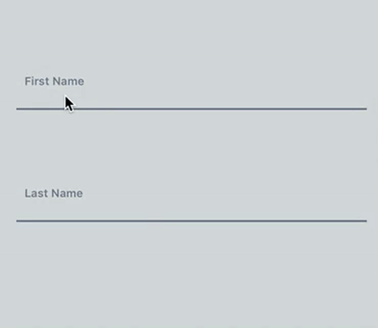

```objective-c
#import "CCTextFieldEffects.h"

//...
@property (strong, nonatomic) JiroTextField *jiroTextField;

//...
// Recommended frame height is around 70.
self.jiroTextField = [[JiroTextField alloc] initWithFrame:<#CGRect#>];

self.jiroTextField.placeholder = <#NSString#>;

// The size of the placeholder label relative to the font size of the text field, default value is 0.65
self.jiroTextField.placeholderFontScale = <#CGFloat#>;

// The color of the border, default value is R106 G121 B137
self.jiroTextField.borderColor = <#UIColor#>;

// The color of the placeholder, default value is R106 G121 B137
self.jiroTextField.placeholderColor = <#UIColor#>;

// The color of the cursor, default value is R211 G226 B226
self.jiroTextField.cursorColor = <#UIColor#>;

// The color of the text, default value is R211 G226 B226
self.jiroTextField.textColor = <#UIColor#>;

// The block excuted when the animation for obtaining focus has completed.
// Do not use textFieldDidBeginEditing:
self.jiroTextField.didBeginEditingHandler = ^{
    // ...
};

// The block excuted when the animation for losing focus has completed.
// Do not use textFieldDidEndEditing:
self.jiroTextField.didEndEditingHandler = ^{
    // ...
};

[self.view addSubview:self.jiroTextField];
```


### Kaede

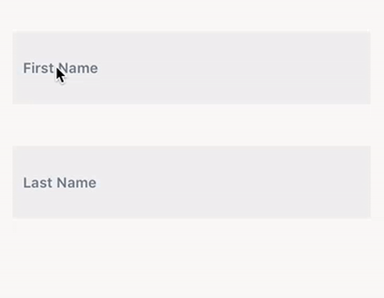

```objective-c
#import "CCTextFieldEffects.h"

//...
@property (strong, nonatomic) KaedeTextField *kaedeTextField;

//...
// Recommended frame height is around 56.
self.kaedeTextField = [[kaedeTextField alloc] initWithFrame:<#CGRect#>];

// The placeholder should not be too long,
// or it will not be fulliy displayed after the text field obtains focus.
self.kaedeTextField.placeholder = <#NSString#>;

// The size of the placeholder label relative to the font size of the text field, default value is 0.8
self.kaedeTextField.placeholderFontScale = <#CGFloat#>;

// The color of the foreground, default value is R239 G238 B238
self.kaedeTextField.foregroundColor = <#UIColor#>;

// The color of background, default value is R255 G255 B255
self.kaedeTextField.backgroundColor = <#UIColor#>;

// The color of the placeholder, default value is R106 G121 B137
self.kaedeTextField.placeholderColor = <#UIColor#>;

// The color of the cursor, default value is R157 G171 B186
self.kaedeTextField.cursorColor = <#UIColor#>;

// The color of the text, default value is R175 G171 B186
self.kaedeTextField.textColor = <#UIColor#>;

// The block excuted when the animation for obtaining focus has completed.
// Do not use textFieldDidBeginEditing:
self.kaedeTextField.didBeginEditingHandler = ^{
    // ...
};

// The block excuted when the animation for losing focus has completed.
// Do not use textFieldDidEndEditing:
self.kaedeTextField.didEndEditingHandler = ^{
    // ...
};

[self.view addSubview:self.kaedeTextField];
```


### Madoka

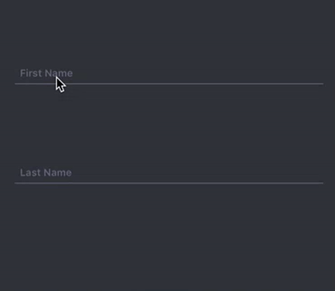

```objective-c
#import "CCTextFieldEffects.h"

//...
@property (strong, nonatomic) MadokaTextField *madokaTextField;

//...
// Recommended frame height is around 70.
self.madokaTextField = [[MadokaTextField alloc] initWithFrame:<#CGRect#>];

self.madokaTextField.placeholder = <#NSString#>;

// The size of the placeholder label relative to the font size of the text field, default value is 0.75
self.madokaTextField.placeholderFontScale = <#CGFloat#>;

// The color of the border, default value is R122 G117 B147 
self.madokaTextField.borderColor = <#UIColor#>;

// The color of the placeholder, default value is R122 G117 B147
self.madokaTextField.placeholderColor = <#UIColor#>;

// The color of the cursor, default value is R122 G117 B147
self.madokaTextField.cursorColor = <#UIColor#>;

// The color of the text, default value is R122 G117 B147
self.madokaTextField.textColor = <#UIColor#>;

// The block excuted when the animation for obtaining focus has completed.
// Do not use textFieldDidBeginEditing:
self.madokaTextField.didBeginEditingHandler = ^{
    // ...
};

// The block excuted when the animation for losing focus has completed.
// Do not use textFieldDidEndEditing:
self.madokaTextField.didEndEditingHandler = ^{
    // ...
};

[self.view addSubview:self.madokaTextField];
```


### Yoko

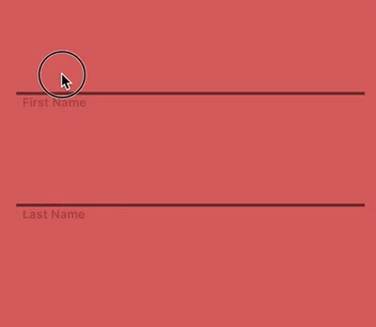

```objective-c
#import "CCTextFieldEffects.h"

//...
@property (strong, nonatomic) YokoTextField *yokoTextField;

//...
// Recommended frame height is around 70.
self.yokoTextField = [[YokoTextField alloc] initWithFrame:<#CGRect#>];

self.yokoTextField.placeholder = <#NSString#>;

// The size of the placeholder label relative to the font size of the text field, default value is 0.7
self.yokoTextField.placeholderFontScale = <#CGFloat#>;

// The color of the foreground, default value is R0 G0 B0
self.yokoTextField.foregroundColor = <#UIColor#>;

// The color of the placeholder, default value is R176 G75 B64
self.yokoTextField.placeholderColor = <#UIColor#>;

// The color of the cursor, default value is R245 G245 B245
self.yokoTextField.cursorColor = <#UIColor#>;

// The color of the text, default value is R245 G245 B245
self.yokoTextField.textColor = <#UIColor#>;

// The block excuted when the animation for obtaining focus has completed.
// Do not use textFieldDidBeginEditing:
self.yokoTextField.didBeginEditingHandler = ^{
    // ...
};

// The block excuted when the animation for losing focus has completed.
// Do not use textFieldDidEndEditing:
self.yokoTextField.didEndEditingHandler = ^{
    // ...
};

[self.view addSubview:self.yokoTextField];
```


### Yoshiko

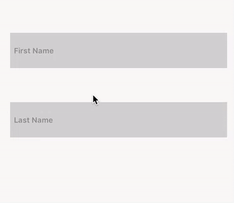

```objective-c
#import "CCTextFieldEffects.h"

//...
@property (strong, nonatomic) YoshikoTextField *yoshikoTextField;

//...
// Recommended frame height is around 70.
self.yoshikoTextField = [[YoshikoTextField alloc] initWithFrame:<#CGRect#>];

self.yoshikoTextField.placeholder = <#NSString#>;

// The size of the placeholder label relative to the font size of the text field, default value is 0.7
self.yoshikoTextField.placeholderFontScale = <#CGFloat#>;

// The color of the active border color, default value is R163 G211 B156
self.yoshikoTextField.activeBorderColor = <#UIColor#>;

// The color of the inactive border color, default value is R208 G209 B208
// Also this is color of the inactive bacoground.
self.yoshikoTextField.inactiveBorderColor = <#UIColor#>;

// The color of the active background, default value is R249 G247 B246
self.yoshikoTextField.activeBackgroundColor = <#UIColor#>;

// The color of the placeholder, default value is R139 G140 B139
self.yoshikoTextField.placeholderColor = <#UIColor#>;

// The color of the cursor, default value is R170 G170 B170
self.yoshikoTextField.cursorColor = <#UIColor#>;

// The color of the text, default value is R170 G170 B170
self.yoshikoTextField.textColor = <#UIColor#>;

// The block excuted when the animation for obtaining focus has completed.
// Do not use textFieldDidBeginEditing:
self.yoshikoTextField.didBeginEditingHandler = ^{
    // ...
};

// The block excuted when the animation for losing focus has completed.
// Do not use textFieldDidEndEditing:
self.yoshikoTextField.didEndEditingHandler = ^{
    // ...
};

[self.view addSubview:self.yoshikoTextField];
```


### Hideo


```objective-c
#import "CCTextFieldEffects.h"

//...
@property (strong, nonatomic) HideoTextField *hideoTextField;

//...
// Recommended frame height is around 56.
self.hideoTextField = [[HideoTextField alloc] initWithFrame:<#CGRect#>];

self.hideoTextField.placeholder = <#NSString#>;

// The size of the image relative to the original size when animated, default value is 0.7
self.hideoTextField.imageScale = <#CGFloat#>;

// The color of the left container, default value is R137 G157 B218 
self.hideoTextField.imageContainerColor = <#UIColor#>;

// The image of the left container.
self.hideoTextField.image = <#UIImage#>;

// The color of background of text area. default value is R255 G255 B255
self.hideoTextField.backgroundColor = <#UIColor#>;

// The color of the cursor, default value is R170 G170 B170
self.hideoTextField.cursorColor = <#UIColor#>;

// The color of the text, default value is R170 G170 B170
self.hideoTextField.textColor = <#UIColor#>;

// The block excuted when the animation for obtaining focus has completed.
// Do not use textFieldDidBeginEditing:
self.hideoTextField.didBeginEditingHandler = ^{
    // ...
};

// The block excuted when the animation for losing focus has completed.
// Do not use textFieldDidEndEditing:
self.hideoTextField.didEndEditingHandler = ^{
    // ...
};

[self.view addSubview:self.hideoTextField];
```


### Haruki

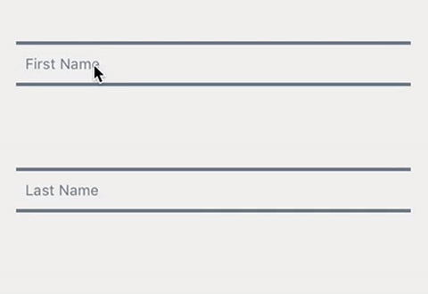

```objective-c
#import "CCTextFieldEffects.h"

//...
@property (strong, nonatomic) HarukiTextField *harukiTextField;

//...
// Recommended frame height is around 70.
self.harukiTextField = [[HarukiTextField alloc] initWithFrame:<#CGRect#>];

self.harukiTextField.placeholder = <#NSString#>;

// The size of the placeholder label relative to the font size of the text field, default value is 0.75
self.harukiTextField.placeholderFontScale = <#CGFloat#>;

// The color of the border, default value is R106 G121 B137 
self.harukiTextField.borderColor = <#UIColor#>;

// The color of the placeholder, default value is R106 G121 B137
self.harukiTextField.placeholderColor = <#UIColor#>;

// The color of the cursor, default value is R175 G181 B187
self.harukiTextField.cursorColor = <#UIColor#>;

// The color of the text, default value is R175 G181 B187
self.harukiTextField.textColor = <#UIColor#>;

// The block excuted when the animation for obtaining focus has completed.
// Do not use textFieldDidBeginEditing:
self.harukiTextField.didBeginEditingHandler = ^{
    // ...
};

// The block excuted when the animation for losing focus has completed.
// Do not use textFieldDidEndEditing:
self.harukiTextField.didEndEditingHandler = ^{
    // ...
};

[self.view addSubview:self.harukiTextField];
```


### Minoru

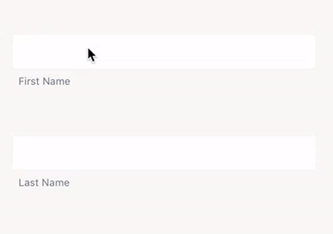

```objective-c
#import "CCTextFieldEffects.h"

//...
@property (strong, nonatomic) MinoruTextField *minoruTextField;

//...
// Recommended frame height is around 70.
self.minoruTextField = [[MinoruTextField alloc] initWithFrame:<#CGRect#>];

self.minoruTextField.placeholder = <#NSString#>;

// The size of the placeholder label relative to the font size of the text field, default value is 0.65
self.minoruTextField.placeholderFontScale = <#CGFloat#>;

// The color of the border, default value is R236 G162 B155 
self.minoruTextField.borderColor = <#UIColor#>;

// The color of the placeholder, default value is R106 G121 B137
self.minoruTextField.placeholderColor = <#UIColor#>;

// The color of background of text area, default value is R255 G255 B255
self.minoruTextField.backgroundColor = <#UIColor#>;

// The color of the cursor, default value is R236 G162 B155
self.minoruTextField.cursorColor = <#UIColor#>;

// The color of the text, default value is R236 G162 B155
self.minoruTextField.textColor = <#UIColor#>;

// The block excuted when the animation for obtaining focus has completed.
// Do not use textFieldDidBeginEditing:
self.minoruTextField.didBeginEditingHandler = ^{
    // ...
};

// The block excuted when the animation for losing focus has completed.
// Do not use textFieldDidEndEditing:
self.minoruTextField.didEndEditingHandler = ^{
    // ...
};

[self.view addSubview:self.minoruTextField];
```


### Kyo

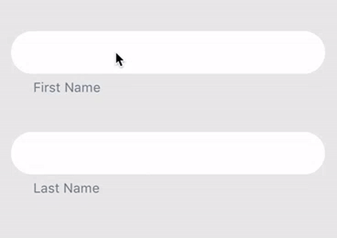

__Note:__ Since Kyo will add a overlay, to dismiss the keyboard, you should write your own code to let `KyoTextField` resign first responder.

```objective-c
#import "CCTextFieldEffects.h"

//...
@property (strong, nonatomic) KyoTextField *kyoTextField;

//...
// Recommended frame height is around 70.
self.kyoTextField = [[KyoTextField alloc] initWithFrame:<#CGRect#>];

self.kyoTextField.placeholder = <#NSString#>;

// The size of the placeholder label relative to the font size of the text field, default value is 0.85
self.kyoTextField.placeholderFontScale = <#CGFloat#>;

// The color of the placeholder, default value is R106 G121 B137
self.kyoTextField.placeholderColor = <#UIColor#>;

// The color of background of text area, default value is R255 G255 B255
self.kyoTextField.backgroundColor = <#UIColor#>;

// The color of the overlay, default value is R61 G88 B210 Alpha0.6
self.kyoTextField.overlayColor = <#UIColor#>;

// The color of the cursor, default value is R83 G93 B146
self.kyoTextField.cursorColor = <#UIColor#>;

// The color of the text, default value is R83 G93 B146
self.kyoTextField.textColor = <#UIColor#>;

// The block excuted when the animation for obtaining focus has completed.
// Do not use textFieldDidBeginEditing:
self.kyoTextField.didBeginEditingHandler = ^{
    // ...
};

// The block excuted when the animation for losing focus has completed.
// Do not use textFieldDidEndEditing:
self.kyoTextField.didEndEditingHandler = ^{
    // ...
};

[self.view addSubview:self.kyoTextField];
```


### Kuro

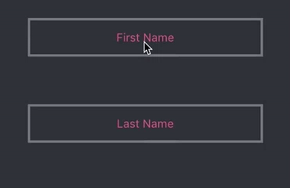

```objective-c
#import "CCTextFieldEffects.h"

//...
@property (strong, nonatomic) KuroTextField *kuroTextField;

//...
// Recommended frame height is around 70.
self.kuroTextField = [[KuroTextField alloc] initWithFrame:<#CGRect#>];

self.kuroTextField.placeholder = <#NSString#>;

// The size of the placeholder label relative to the font size of the text field, default value is 0.85
self.kuroTextField.placeholderFontScale = <#CGFloat#>;

// The color of the border, default value is R116 G121 B129
self.kuroTextField.borderColor = <#UIColor#>;

// The color of the placeholder, default value is R223 G101 B137
self.kuroTextField.placeholderColor = <#UIColor#>;

// The color of the cursor, default value is R145 G150 B161
self.kuroTextField.cursorColor = <#UIColor#>;

// The color of the text, default value is R145 G150 B161
self.kuroTextField.textColor = <#UIColor#>;

// The block excuted when the animation for obtaining focus has completed.
// Do not use textFieldDidBeginEditing:
self.kuroTextField.didBeginEditingHandler = ^{
    // ...
};

// The block excuted when the animation for losing focus has completed.
// Do not use textFieldDidEndEditing:
self.kuroTextField.didEndEditingHandler = ^{
    // ...
};

[self.view addSubview:self.kuroTextField];
```


### Ruri

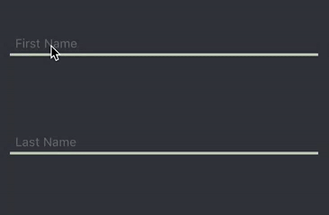

```objective-c
#import "CCTextFieldEffects.h"

//...
@property (strong, nonatomic) RuriTextField *ruriTextField;

//...
// Recommended frame height is around 70.
self.ruriTextField = [[RuriTextField alloc] initWithFrame:<#CGRect#>];

self.ruriTextField.placeholder = <#NSString#>;

// The size of the placeholder label relative to the font size of the text field, default value is 0.8
self.ruriTextField.placeholderFontScale = <#CGFloat#>;

// The color of the lower border, default value is R183 G195 B172
self.ruriTextField.borderColor = <#UIColor#>;

// The color of the border and the placeholder when the text field is not empty or focused, default value is R163 G211 B156
self.ruriTextField.activeColor = <#UIColor#>;

// The color of the placeholder, default value is R105 G105 B105
self.ruriTextField.placeholderColor = <#UIColor#>;

// The color of the cursor, default value is R255 G255 B255
self.ruriTextField.cursorColor = <#UIColor#>;

// The color of the text, default value is R255 G255 B255
self.ruriTextField.textColor = <#UIColor#>;

// The block excuted when the animation for obtaining focus has completed.
// Do not use textFieldDidBeginEditing:
self.ruriTextField.didBeginEditingHandler = ^{
    // ...
};

// The block excuted when the animation for losing focus has completed.
// Do not use textFieldDidEndEditing:
self.ruriTextField.didEndEditingHandler = ^{
    // ...
};

[self.view addSubview:self.ruriTextField];
```


### Chisato

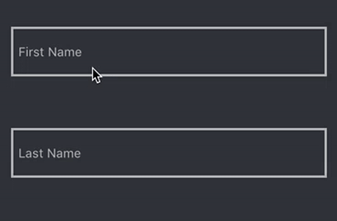

```objective-c
#import "CCTextFieldEffects.h"

//...
@property (strong, nonatomic) ChisatoTextField *chisatoTextField;

//...
// Recommended frame height is around 70.
self.chisatoTextField = [[ChisatoTextField alloc] initWithFrame:<#CGRect#>];

self.chisatoTextField.placeholder = <#NSString#>;

// The size of the placeholder label relative to the font size of the text field, default value is 0.8
self.chisatoTextField.placeholderFontScale = <#CGFloat#>;

// The color of the border bounds, default value is R181 G181 B181
self.chisatoTextField.borderColor = <#UIColor#>;

// The color of the border and the placeholder when the text field is not empty or focused, default value is R218 G100 B132
self.chisatoTextField.activeColor = <#UIColor#>;

// The color of the placeholder, default value is R181 G181 B181
self.chisatoTextField.placeholderColor = <#UIColor#>;

// The color of the cursor, default value is R181 G181 B181
self.chisatoTextField.cursorColor = <#UIColor#>;

// The color of the text, default value is R181 G181 B181
self.chisatoTextField.textColor = <#UIColor#>;

// The block excuted when the animation for obtaining focus has completed.
// Do not use textFieldDidBeginEditing:
self.chisatoTextField.didBeginEditingHandler = ^{
    // ...
};

// The block excuted when the animation for losing focus has completed.
// Do not use textFieldDidEndEditing:
self.chisatoTextField.didEndEditingHandler = ^{
    // ...
};

[self.view addSubview:self.chisatoTextField];
```


### Manami

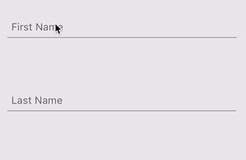

```objective-c
#import "CCTextFieldEffects.h"

//...
@property (strong, nonatomic) ManamiTextField *manamiTextField;

//...
// Recommended frame height is around 70.
self.manamiTextField = [[ManamiTextField alloc] initWithFrame:<#CGRect#>];

self.manamiTextField.placeholder = <#NSString#>;

// The size of the placeholder label relative to the font size of the text field, default value is 0.9
self.manamiTextField.placeholderFontScale = <#CGFloat#>;

// The color of the lower border, default value is R168 G168 B168
self.manamiTextField.borderColor = <#UIColor#>;

// The color of the text area background, default value is R168 G168 B168
self.manamiTextField.backgroundColor = <#UIColor#>;

// The color of the placeholder, default value is R105 G105 B105
self.manamiTextField.placeholderColor = <#UIColor#>;

// The color of the cursor, default value is R249 G247 B246
self.manamiTextField.cursorColor = <#UIColor#>;

// The color of the text, default value is R249 G247 B246
self.manamiTextField.textColor = <#UIColor#>;

// The block excuted when the animation for obtaining focus has completed.
// Do not use textFieldDidBeginEditing:
self.manamiTextField.didBeginEditingHandler = ^{
    // ...
};

// The block excuted when the animation for losing focus has completed.
// Do not use textFieldDidEndEditing:
self.manamiTextField.didEndEditingHandler = ^{
    // ...
};

[self.view addSubview:self.manamiTextField];
```


### Nariko

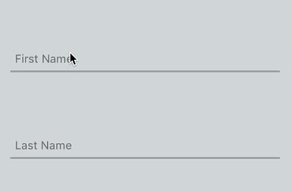

```objective-c
#import "CCTextFieldEffects.h"

//...
@property (strong, nonatomic) NarikoTextField *narikoTextField;

//...
// Recommended frame height is around 70.
self.narikoTextField = [[NarikoTextField alloc] initWithFrame:<#CGRect#>];

self.narikoTextField.placeholder = <#NSString#>;

// The size of the placeholder label relative to the font size of the text field, default value is 0.85
self.narikoTextField.placeholderFontScale = <#CGFloat#>;

// The color of the lower border, default value is R155 G159 B159
self.narikoTextField.borderColor = <#UIColor#>;

// The color of the text area background, default value is R255 G255 B255
self.narikoTextField.backgroundColor = <#UIColor#>;

// The color of the placeholder, default value is R155 G159 B159
self.narikoTextField.placeholderColor = <#UIColor#>;

// The color of the cursor, default value is R241 G130 B146
self.narikoTextField.cursorColor = <#UIColor#>;

// The color of the text, default value is R241 G130 B146
self.narikoTextField.textColor = <#UIColor#>;

// The block excuted when the animation for obtaining focus has completed.
// Do not use textFieldDidBeginEditing:
self.narikoTextField.didBeginEditingHandler = ^{
    // ...
};

// The block excuted when the animation for losing focus has completed.
// Do not use textFieldDidEndEditing:
self.narikoTextField.didEndEditingHandler = ^{
    // ...
};-

[self.view addSubview:self.narikoTextField];
```


### Sae

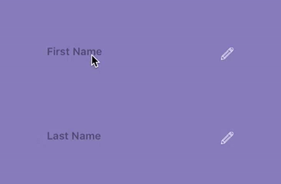

```objective-c
#import "CCTextFieldEffects.h"

//...
@property (strong, nonatomic) SaeTextField *saeTextField;

//...
// Recommended frame height is around 70.
// Frame width should be shorter than other tpyes of text field.
self.saeTextField = [[SaeTextField alloc] initWithFrame:<#CGRect#>];

self.saeTextField.placeholder = <#NSString#>;

// The size of the placeholder label relative to the font size of the text field, default value is 0.8
self.saeTextField.placeholderFontScale = <#CGFloat#>;

// The color of the lower border, default value is R255 G255 B255
self.saeTextField.borderColor = <#UIColor#>;

// The color of the placeholder, default value is R0 G0 B0 Alpha0.4
self.saeTextField.placeholderColor = <#UIColor#>;

// The color of the cursor, default value is R255 G255 B255
self.saeTextField.cursorColor = <#UIColor#>;

// The color of the text, default value is R255 G255 B255
self.saeTextField.textColor = <#UIColor#>;

// The image in the right-down corner, default value is a pencil icon. The color of the image is determined by borderColor.
self.saeTextField.image = <#UIImage#>;

// The block excuted when the animation for obtaining focus has completed.
// Do not use textFieldDidBeginEditing:
self.saeTextField.didBeginEditingHandler = ^{
    // ...
};

// The block excuted when the animation for losing focus has completed.
// Do not use textFieldDidEndEditing:
self.saeTextField.didEndEditingHandler = ^{
    // ...
};

[self.view addSubview:self.saeTextField];
```


### Kohana

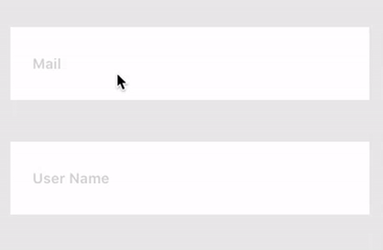

```objective-c
#import "CCTextFieldEffects.h"

//...
@property (strong, nonatomic) KohanaTextField *kohanaTextField;

//...
// Recommended frame height is around 56.
self.kohanaTextField = [[KohanaTextField alloc] initWithFrame:<#CGRect#>];

self.kohanaTextField.placeholder = <#NSString#>;

// The size of the placeholder label relative to the font size of the text field, default value is 0.8
self.kohanaTextField.placeholderFontScale = <#CGFloat#>;

// The color of the placeholder, default value is R210 G210 B210
self.kohanaTextField.placeholderColor = <#UIColor#>;

// The color of background of text area, default value is R255 G255 B255
self.kohanaTextField.backgroundColor = <#UIColor#>;

// The color of the cursor, default value is R106 G121 B137
self.kohanaTextField.cursorColor = <#UIColor#>;

// The color of the text, default value is R106 G121 B137
self.kohanaTextField.textColor = <#UIColor#>;

// The image of the control. The color of the image is determined by placeholderColor.
self.kohanaTextField.image = <#UIImage#>;

// The block excuted when the animation for obtaining focus has completed.
// Do not use textFieldDidBeginEditing:
self.kohanaTextField.didBeginEditingHandler = ^{
    // ...
};

// The block excuted when the animation for losing focus has completed.
// Do not use textFieldDidEndEditing:
self.kohanaTextField.didEndEditingHandler = ^{
    // ...
};

[self.view addSubview:self.kohanaTextField];
```


## TODO

- More types of effects.

